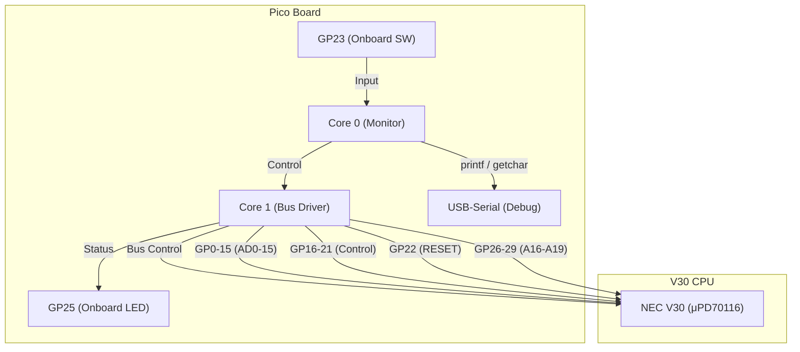

# Raspberry Pi Pico & NEC V30 接続プロジェクト

## 概要
このドキュメントは、Raspberry Pi Pico互換機（RP2040ベース）を使用して、NEC V30 (μPD70116) CPUを3.3Vで駆動させる最小構成システムのハードウェア接続方法をまとめたものです。

Picoのデュアルコアを活用し、Core 1がV30のバスをエミュレートし、Core 0がPCとのUSBシリアル通信やモニタプログラムを担当します。

## ハードウェア構成
- **CPU**: NEC V30 (μPD70116)
- **コントローラ**: Raspberry Pi Pico互換機 (GP0-22, 24, 26-29が使用可能なボード)
- **ロジック電圧**: **3.3V**
    - V30のVCC(40ピン)にPicoの3.3Vを供給することで、レベルシフタが不要になります。

### ブロック図


## ピン接続
### V30 - Pico 接続テーブル
V30の全40ピンの接続先一覧です。PicoのGPIOは、プログラミングのしやすさを考慮して連続したブロックに割り当てています。

| グループ            | Pico GPIO | V30 Pin  | V30ピン名  | 方向 (Pico) | 役割・備考                              |
|---------------------|-----------|----------|------------|-------------|-----------------------------------------|
| **データ/アドレス** | GP0-15    | (下記)   | AD0 - AD15 | In/Out      | バスライン。330Ωの短絡保護抵抗を推奨。 |
| **制御信号**        | GP16      | 25       | ALE        | In          | アドレスラッチ信号                      |
|                     | GP17      | 32       | `RD`       | In          | 読み込み信号                            |
|                     | GP18      | 29       | `WR`       | In          | 書き込み信号                            |
|                     | GP19      | 28       | IO/`M`     | In          | メモリ/IO選択                           |
|                     | GP20      | 34       | `BHE`      | In          | バスハイイネーブル                      |
| **クロック**        | GP21      | 19       | CLK        | Out         | PicoからV30へクロックを供給             |
| **リセット**        | GP22      | 21       | RESET      | Out         | V30のリセット制御用                     |
| **オンボードSW**    | GP23      | (基板上) | User SW    | In          | ソフトウェアリセットのトリガー等に使用  |
| **予備**            | GP24      | -        | -          | -           | 将来の拡張用 (空き)                     |
| **オンボードLED**   | GP25      | (基板上) | User LED   | Out         | バスアクセスやステータス表示に使用      |
| **上位アドレス**    | GP26      | 38       | A16/S3     | In          | アドレス拡張                            |
|                     | GP27      | 37       | A17/S4     | In          |                                         |
|                     | GP28      | 36       | A18/S5     | In          |                                         |
|                     | GP29      | 35       | A19/S6     | In          | リセットベクタ `FFFF0h` の検知に利用    |

*ADバス詳細:*
- `AD0..AD7` (V30 Pins 16..9) -> `Pico GP0..GP7`
- `AD8..AD15` (V30 Pins 8..2, 39) -> `Pico GP8..GP15`

### V30 固定ピン接続
以下のV30ピンは、Picoに接続せず、VCC(3.3V)またはGNDに直接接続します。

| V30 Pin | V30ピン名 | 接続先       | 理由                                       |
| ------- | --------- | ------------ | ------------------------------------------ |
| 40      | VCC       | **3.3V**     | V30を3.3Vで駆動するため                    |
| 1, 20   | GND       | **GND**      | 接地                                       |
| 33      | MN/`MX`   | **3.3V**     | ミニマムモードで動作させるため             |
| 22      | READY     | **3.3V**     | ウェイトステートを発生させないため         |
| 23      | `TEST`    | **GND**      | `WAIT`命令によるCPUフリーズを回避するため  |
| 17      | NMI       | **GND**      | 割り込みを使用しないため                   |
| 18      | INTR      | **GND**      | 割り込みを使用しないため                   |
| 31      | HOLD      | **GND**      | DMAを使用しないため                        |
| 24      | `INTA`    | Open (未接続)| 割り込みを使用しないため                   |
| 26      | `DEN`     | Open (未接続)| Picoが直接バスを制御するため不要           |
| 27      | DT/`R`    | Open (未接続)| Picoが`RD`/`WR`で方向を判断するため不要    |
| 30      | HLDA      | Open (未接続)| DMAを使用しないため                        |


## 短絡保護について
V30を3.3Vで駆動するため電圧変換は不要ですが、開発中のプログラムのバグ等でPicoとV30が同時にバスに出力（バス衝突）する可能性があります。
これを防ぎチップを保護するため、**AD0-AD15の各バスラインに330Ω程度の抵抗を直列に挿入する**ことを強く推奨します。

```
V30 (ADx)  ----[ 330Ω ]---- Pico (GPx)
```

## モニタプログラム仕様
PicoのCore 0上で動作するモニタプログラムのコマンド一覧です。USBシリアルコンソール経由で操作します。

| コマンド   | 引数               | 説明                                                                       |
|------------|--------------------|----------------------------------------------------------------------------|
| `?`        | -                  | ヘルプメッセージを表示します。                                             |
| `d`        | `<addr> [len]`     | 指定アドレスからメモリ内容をダンプします。`len`はデフォルト256バイトです。 |
| `e`        | `<addr> <val>...`  | 指定アドレスのメモリを16進数の値で書き換えます。                           |
| `l`        | `<addr> [len]`     | 指定アドレスから逆アセンブルします。（現在未実装）                         |
| `r`        | -                  | V30を実行し、バスのログを取得します（最大5000サイクル）。                   |
| `g`        | -                  | V30をログなしで連続実行します。任意のキーを押すと停止します。              |
| `c`        | `[kHz]`            | V30のクロック周波数を設定・表示します。引数なしで利用可能な周波数を表示。    |
| `xr`       | -                  | XMODEM(CRC)でPicoのRAMにバイナリを書き込みます。                           |
| `xs`       | -                  | PicoのRAM内容をXMODEM(CRC)で送信します。                                   |
| `xl`       | -                  | `r`コマンドで取得したバスログをXMODEM(CRC)で送信します。                     |
| `v`        | -                  | モニタのバージョンとRAMサイズを表示します。                                  |
| `autotest` | -                  | `xr` -> `r` -> `xl` を一括で実行する自動テスト機能です。                   |
